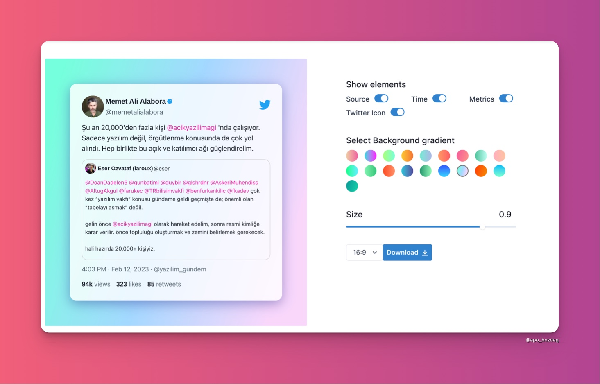

# 🐦 Twimage - Convert tweets to beautiful images.

[Check out the website](https://tweet-to-image-smoky.vercel.app). If you like it, or find it useful in any way, drop a 🌟 at the repo. Why? Because it keeps a beginner moving forward 😄.

## What it does?
Twimage is a simple web app made with **NextJS, Twitter API and Chakra UI** that converts your favourite tweets to an image. You can choose between formats PNG, JPEG and SVG.

## Screenshots

### The Home Page

## Author
[Abdullah Bozdag](https://twitter.com/apo_bozdag)
[Prince Kumar Singh](http://www.twitter.com/drkPrns)

## Disclaimer
This is not affiliated to Twitter in any way. It's just a side project made for learning purposes. No copyright infringement intended.

